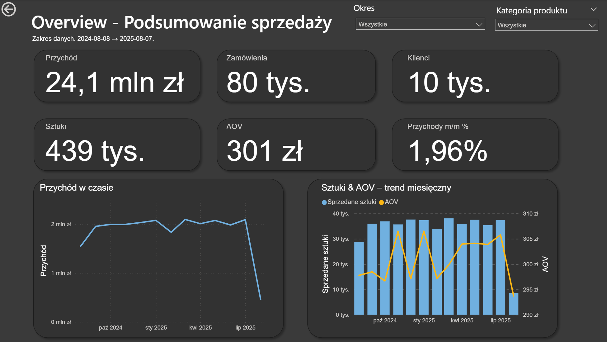
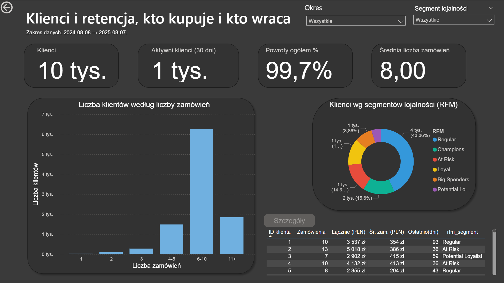
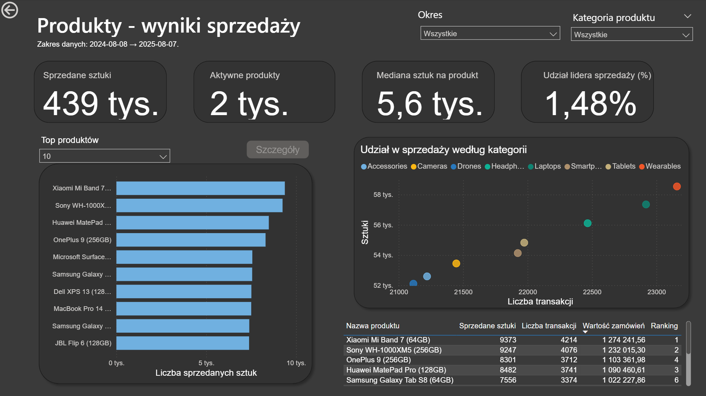
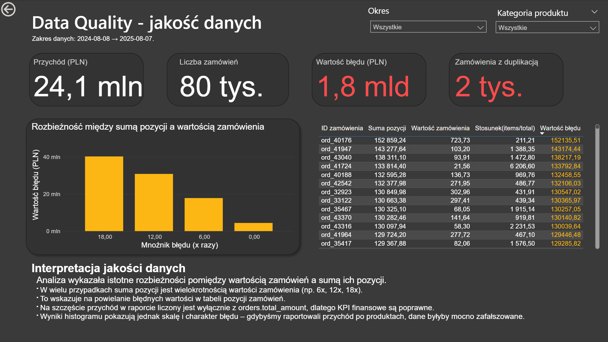
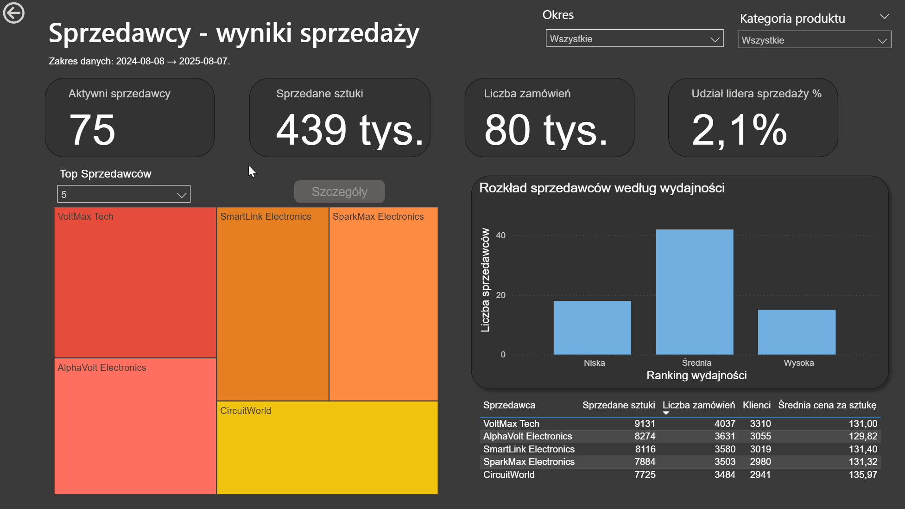

# 🧭 Complete BI Dashboard — Analiza Sprzedaży & Data Quality (End-to-End)
**Autor:** Michał Pióro · **Rok:** 2025  

---

## 🚀 TL;DR  

Kompletny projekt **Business Intelligence** w obszarze e-commerce:  
**Python (ETL & EDA)** → **PostgreSQL (views, materialized views, sanity checks)** → **Power BI (dashboard, drillthrough, data quality)**  

Pokazuje pełen proces - od surowych danych po gotowy raport biznesowy.  
Unikalny element: dedykowana strona **Data Quality** z KPI i wizualizacją błędów danych.  

---

## 🛠️ Tech Stack  

- **Python:** Pandas, Psycopg2, Matplotlib  
- **SQL / PostgreSQL:** widoki, materialized views, sanity checks  
- **Power BI:** DAX, drillthrough, TopN slicers, UX design  
- **Repozytorium:** Git, modularna struktura (`/python`, `/sql`, `/powerbi`)  

---

## 📊 Krótki opis  

Projekt BI w obszarze **e-commerce**, oparty na syntetycznych danych:  
 80k zamówień, 220k sztuk, 2k produktów, 10k klientów.  

Prezentuje kompletny **end-to-end pipeline**:  

1. **ETL & Data Cleaning (Python)** – czyszczenie, eksploracja, sanity checks, zapis do schematu `clean`.  
2. **Warstwa analityczna (PostgreSQL)** – widoki, materialized views i kontrole jakości danych.  
3. **Dashboard (Power BI)** – KPI, segmentacja klientów (RFM), TopN produkty/sprzedawcy, drillthrough i strona **Data Quality**.  

Dane zostały **wygenerowane syntetycznie** na potrzeby projektu.  

---

### 🧹 ETL & Data Cleaning (Python)

Fragment przykładowego kodu pokazujący czyszczenie danych i sanity check:  

```python
# SPECYFICZNE POPRAWKI
    if table == "sellers":
        bad_cols = [col for col in df.columns if ";" in col]
        if bad_cols:
            print(f" - Usuwam kolumny z błędnymi nagłówkami: {bad_cols}")
            df.drop(columns=bad_cols, inplace=True, errors="ignore")
        if "location" in df.columns:
            missing = df["location"].isna().sum()
            if missing > 0:
                print(f" - Uzupełniam brakujące location ({missing} wierszy) 'unknown'")
                df["location"].fillna("unknown", inplace=True)
```
Ten etap przygotowuje dane do wczytania do bazy PostgreSQL (schemat clean).

---

### 🧠 Warstwa analityczna (SQL / PostgreSQL)

Przykładowe zapytanie stanowiące podstawę do analiz kohort użytkowników:
```sql
-- Cohorty miesięczne (wg pierwszego zakupu)
CREATE MATERIALIZED VIEW IF NOT EXISTS analytics.cohorts_monthly AS
WITH first_orders AS (
    SELECT 
        user_id, 
        date_trunc('month', MIN(order_date))::date AS cohort_month
    FROM analytics.fact_orders
    GROUP BY user_id
),
orders_m AS (
    SELECT 
        user_id, 
        date_trunc('month', order_date)::date AS order_month
    FROM analytics.fact_orders
)
SELECT 
    f.cohort_month,
    o.order_month,
    COUNT(DISTINCT o.user_id) AS users
FROM first_orders f
JOIN orders_m o USING (user_id)
GROUP BY f.cohort_month, o.order_month
ORDER BY f.cohort_month, o.order_month;
```
Dzięki temu logika analityczna pozostaje spójna i łatwa do utrzymania w warstwie danych.

---

### 📈 Eksploracja danych (EDA)

Podstawowa wizualizacja rozkładu wartości zamówień:
```python
# Wykres wartości zamówień
    plt.figure(figsize=(9,5.5))
    sns.histplot(orders["total_amount"], bins=40, kde=True, color="teal")
    plt.title("Rozkład wartości zamówień")
    plt.xlabel("Wartość zamówienia")
    plt.ylabel("Liczba zamówień")
    plt.savefig("reports/fig/hist_orders_total_amount.png", dpi=150, bbox_inches="tight")
    plt.close()
```
Pomaga w identyfikacji anomalii i outlierów przed modelowaniem analitycznym.

---

### 💡 Dashboard (Power BI)
Dashboard zawiera 6 głównych stron:
1. **Overview** - KPI + trendy miesięczne
2. **Klienci** - segmentacja klientów, aktywność zakupowa
3. **Sprzedawcy** - TopN sprzedawców, rozkład według wydajności
4. **Produkty** - TopN produktów, udział według kategorii
5. **Data Quality** - wykres rozbieżności i tabela błędnych zamówień
6. **Drillthrough Pages** - szczegóły dla klienta, produktu i sprzedawcy  

**Strony szczegółowe dostępne tylko przez mechanizm drillthrough (utrzymanie kontekstu i czystości UX).**

---

## 🖼️ Demo / Screenshots

Pliki znajdują się w katalogu `assets/screenshots/`:

### 📌 Strona 1: Overview


---

### 📌 Strona 2: Klienci


---

### 📌 Strona 3: Sprzedawcy


---

### 📌 Strona 4: Produkty


---

### 📌 Strona 5: Data Quality


---

### 🎥 Drillthrough w akcji


---

### 📐 Przykładowe miary DAX 

```dax
--Revenue (źródło prawdy o przychodzie)
Revenue = SUM('v_order_facts'[total_amount])


--Revenue previous month (dla obliczenia przychodu m/m)
Revenue Prev Month = CALCULATE([Revenue], DATEADD('analytics v_dim_date'[dt], -1, MONTH))


--Dynamiczny tytuł dla strony 'Szczegóły Produktu'
DynamicznyTytul_Product = 
VAR WybranyProdukt = SELECTEDVALUE ( 'analytics v_products'[product_name] )
RETURN
    IF (
        NOT ISBLANK ( WybranyProdukt ),
        "🔹 Szczegóły dla produktu: " & WybranyProdukt,
        "Wybierz produkt na stronie Produkty"
    )
```

---

## 🧩 Model i decyzje projektowe
- **Źródło prawdy dla Przychodu:** orders.total_amount  
W testowych danych order_items.line_total generowało rozbieżność (1.8 mld vs 24 mln).
- **Wydajność:** kluczowe agregaty utrzymywane w materialized views.
- **Data Quality:** sanity checks w SQL + wizualizacja błędów w Power BI.  
  Skrypt sprawdzający dane przed importem do Power Bi i dedykowana strona dashboardu

---

## ⚙️ Quick Start

```bash
git clone <repo>
pip install -r requirements.txt

# Plik konfiguracyjny
touch .env  # zawiera DB_HOST, DB_NAME, DB_USER, DB_PASS

# Uruchomienie ETL (Python)
scripts/export_raw.py
scripts/data_cleaning.py

# W PostgreSQL uruchom po kolei:
00_setup.sql → 01_base_views.sql → 02_fact_views.sql → 03_materialized_views.sql → 05_refresh.sql → 07_quality_checks.sql → 08_rfm_segments.sql → 09_anomalies_orders.sql

# Dashboard
Otwórz powerbi/dashboard.pbix, zaktualizuj connection string i odśwież dane.
```

---

## 📊 Kluczowe wnioski
- **Revenue (źródło prawdy)** = 24 mln PLN (orders.total_amount)
- **Rozbieżność:** estymacja per-product = 1.8 mld (błąd w danych źródłowych)
- **Technicznie:** materialized views + sanity checks = stabilny i szybki model BI

---

## 🗺️ Roadmap
- Automatyczne testy jakości danych
- Przeniesienie logiki DAX do SQL dla większej wydajności

---

## 📬 Kontakt i Licencja
**Autor:** Michał Pióro  
💻 GitHub: [michalpioro28](https://github.com/michalpioro28)  
🧾 Licencja: MIT
